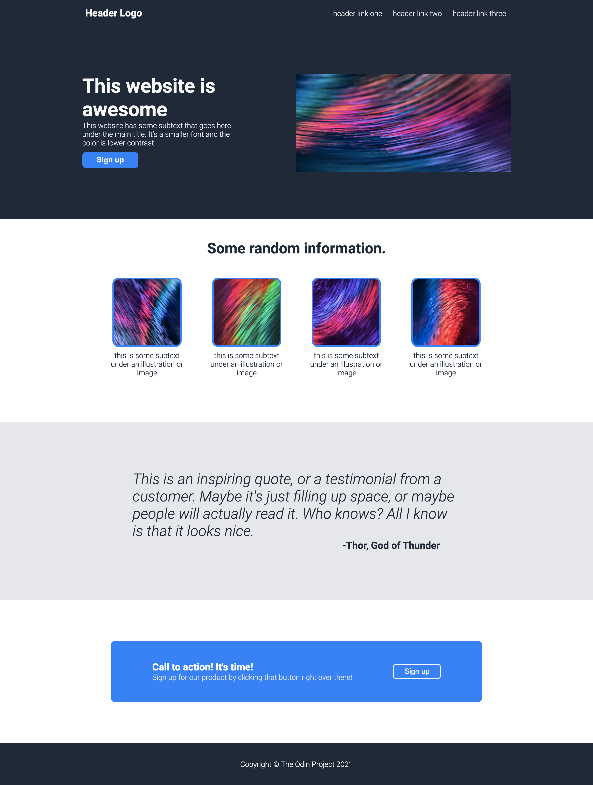

## The Odin Project 

### The project: Landing Page
The purpose of this project is to create a basic landing page to practice HTML and CSS Flexbox.
I followed [the design](https://cdn.statically.io/gh/TheOdinProject/curriculum/main/foundations/html_css/project/odin-project.png) provided by The Odin Project. 
